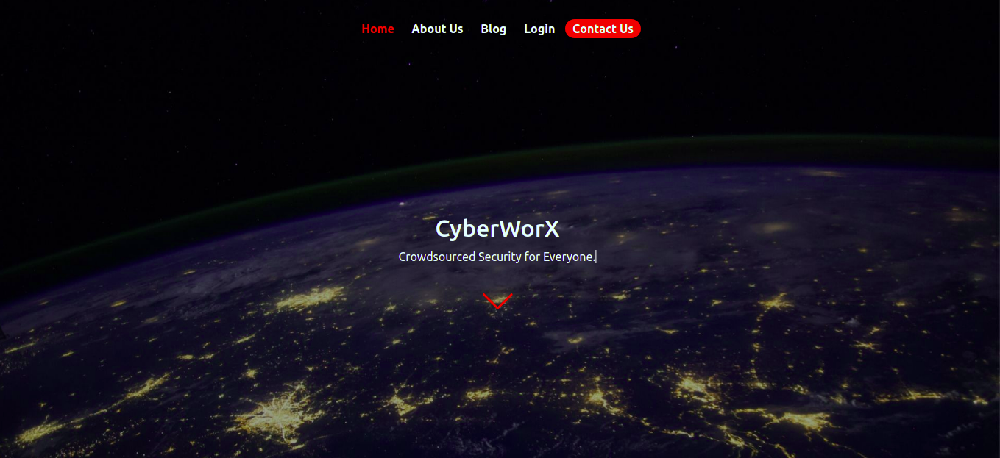

# CyberWorX

### Project Prototype
Prototype Url : https://www.figma.com/proto/NwSBxtiCJ6xqFmLfbkEc2O/CyberWorX?node-id=1%3A2&scaling=min-zoom&page-id=0%3A1

### Live Release
Live Demo : https://cyberworx-ke.github.io/CyberWorX/

## Description
CyberWorX is a community of white hat hackers and programmers that want to create a safer space in the cyber world whereby companies and users are able to use the internet, websites, web apps and mobiles apps safely by helping companies secure their systeam from potential attacks. We bring together companies and cyber security researchers who help the companies secure thier systems in a better and much safer way by patching the existing bugs in their systems. We move away from the traditional way of hiring penetester since a standard penetration test is time-bound and assesses a single moment in time.

Kickstart your bug bounty program and protect your assets every hour of every day, and every week. Cost effective & simple. Launch in a few clicks with the help of our customer success team. We make sure you only provide a bounty reward for unique and previously unknown security vulnerability reports. Every incoming submission is validated by our team of experts before it reaches you.


##  Project Landing Page




## Setup/Installation Requirements

- python3 installed
- ```git clone https://github.com/CyberWorX-KE/CyberWorX.git && cd CyberWorX && sudo python3 -m http.server 80 & && open http://localhost/```


## Contributions
If you'd like to contribute.
- Fork the repo
- Create a new branch (git checkout -b feature)
- Make the appropriate changes in the files
- Add changes to reflect the changes made
- Commit your changes (git commit -am 'Improve/Add feature')
- Push to the branch (git push origin feature)
- Create a Pull Request
[Make sure your code is properly commented]
If you find a bug, kindly open an issue <a href="https://github.com/Chal13W1zz/CyberWorX/issues/new">Here</a> .
If you'd like to request a new function, feel free to do so by opening an issue <a href="https://github.com/Chal13W1zz/CyberWorX/issues/new">Here</a>.

## Technologies Used

- Figma - Used for design and prototyping
- HTML - Used to create the website structure
- CSS - Used to style the website
- Bootstrap  - Used for responsiveness
- Jquery - Used for interactivity
- Fontawesome  - Used for the icons
- Javascript  -  Used for state management and input processing
- Firebase -  Used for storage and authentication

## Connect With Us

<a href="mailto:faith.muthoni@student.moringaschool.com,samson.nyagwara@student.moringaschool.com,lilian.mutia@student.moringaschool.com,leon.mwangi@student.moringaschool.com,brian.mwenda@student.moringaschool.com, charles.muthii@student.moringaschool.com">Email Us</a>

     
### License
## <a href="https://github.com/Chal13W1zz/FindX/blob/main/LICENSE">Licence</a>
Copyright © 2021 FindX Group
 
